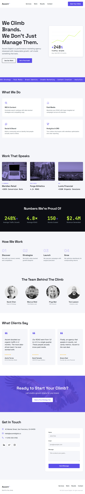

# 🚀 Ascent Digital – Marketing Agency Website

A premium, modern, and fully responsive landing page for **Ascent Digital**, a fictional digital marketing agency. This project was built to demonstrate front-end development skills, clean UI design, responsive layouts, and engaging user interactions.

## 🌐 Live Demo

👉 https://annuscodes.github.io/digital-marketing-agency/

---

## 📸 Preview

> Add a screenshot here after creating an `assets/images` folder.

```md

```

---

## ✨ Features

- Modern agency landing page
- Fully responsive design
- Clean and minimal UI
- Animated sections using GSAP
- Scroll-triggered animations
- Services section
- Portfolio / Case Studies
- Team members
- Testimonials
- Statistics section
- Contact form
- SEO-friendly HTML structure

---

## 🛠️ Built With

- HTML5
- CSS3
- JavaScript (ES6)
- GSAP 3
- ScrollTrigger
- Google Fonts

---

## 📁 Project Structure

```
digital-marketing-agency/
│
├── css/
│   └── style.css
│
├── js/
│   └── script.js
│
├── index.html
├── README.md
└── assets/
    └── images/
```

---

## 🚀 Getting Started

Clone the repository

```bash
git clone https://github.com/annuscodes/digital-marketing-agency.git
```

Open the project

```bash
cd digital-marketing-agency
```

Run

Simply open `index.html` in your browser.

No build process is required.

---

## 🎯 Purpose

This project was created as part of my front-end development portfolio to demonstrate my ability to build professional business websites using modern web technologies.

---

## 📈 Future Improvements

- Dark mode
- Blog section
- Form backend integration
- CMS integration
- Performance optimization
- Accessibility improvements

---

## 👨‍💻 Author

**Muhammad Annus**

GitHub:
https://github.com/annuscodes

LinkedIn:
www.linkedin.com/in/muhammad-annus-a2299b297

Portfolio:
-

---

## ⭐ If you like this project

Give it a ⭐ on GitHub!
